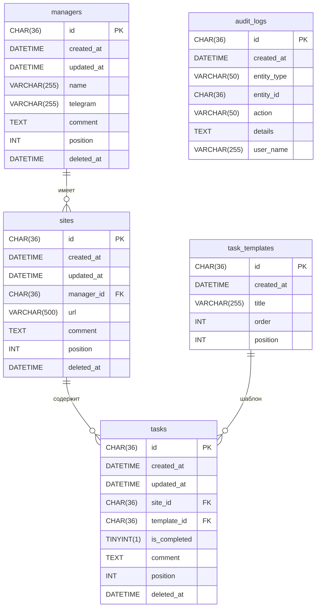

# SEO Workspace CRM

**Статус:** Production с августа 2024
**Стек:** React 18, TypeScript, PHP 8, MySQL

Коммерческая CRM-система для SEO-агентства — управление менеджерами, клиентскими сайтами и задачами. Разработана под ключ: от сбора требований у заказчика до деплоя на shared-хостинг.

---

## Архитектурные решения

**Единый data-эндпоинт** (`/api/crm_data.php`)
Вместо отдельных запросов для менеджеров, сайтов и задач — один эндпоинт собирает полное дерево `Managers → Sites → Tasks` тремя SELECT-запросами и формирует вложенную структуру на PHP. SPA получает всё за один HTTP-запрос и инициализируется без дозагрузок.

**Soft Delete** (`deleted_at`)
Сущности не удаляются физически. При удалении проставляется `deleted_at = NOW()`. Реализована «Корзина» с возможностью восстановления через `deleted_at = NULL`. Каскадная логика: удаление менеджера скрывает его сайты, удаление сайта — его задачи.

**Audit Log** (`audit_logs`)
Каждая мутирующая операция (создание, изменение статуса задачи, перемещение в корзину, восстановление) логируется в `audit_logs` с UUID v4. Фронтенд пишет лог через `POST /api/logs.php` после каждого успешного API-вызова.

**Автогенерация задач при добавлении сайта**
`POST /api/sites.php` выполняется в транзакции: INSERT сайта + цикл INSERT задач из `task_templates` с сохранением порядка (`position`). Если INSERT задач падает — откат всей транзакции через `rollBack()`.

---

## Схема БД



Индексы: `idx_sites_manager_id`, `idx_tasks_site_id`, `idx_tasks_template_id`, `idx_logs_entity`, `idx_managers_deleted`, `idx_sites_deleted`, `idx_tasks_deleted`.

---

## Интерфейс


---

## Стек

| Слой | Технологии |
|---|---|
| Frontend | React 18, TypeScript, Vite |
| UI | Ant Design 5, dnd-kit (Drag & Drop) |
| Состояние | @tanstack/react-query |
| Backend | PHP 8, PDO, Prepared Statements |
| База данных | MySQL 5.7+ / MariaDB 10.2+ |
| Хостинг | Shared-хостинг, Apache + mod_rewrite |

---

## Запуск локально

**Требования:** PHP 8.0+, MySQL 5.7+, Node.js 18+

```bash
# 1. Клонировать репозиторий
git clone https://github.com/dizro/seo-workspace-crm.git
cd seo-workspace-crm

# 2. Настроить БД
# Создайте базу данных MySQL и импортируйте схему
mysql -u root -p your_db < mysql_setup.sql

# 3. Настроить подключение
cp api/config.example.php api/config.php
# Отредактируйте api/config.php — укажите данные вашей БД и пароль входа

# 4. Установить зависимости и собрать фронтенд
npm install
npm run build

# 5. Для разработки — запустить dev-сервер
npm run dev
# API при этом должно быть доступно на том же домене (настройте proxy в vite.config.ts)
```

**Для production:** загрузите содержимое `dist/` и папку `api/` в `public_html/` на хостинг. `.htaccess` уже настроен.

---

## API

| Метод | Эндпоинт | Описание |
|---|---|---|
| GET | `/api/crm_data.php` | Полное дерево данных (основной эндпоинт) |
| GET/POST/PUT/DELETE | `/api/managers.php` | CRUD менеджеров |
| GET/POST/PUT/DELETE | `/api/sites.php` | CRUD сайтов |
| GET/PUT/DELETE | `/api/tasks.php` | CRUD задач |
| GET/POST/PUT/DELETE | `/api/templates.php` | CRUD шаблонов задач |
| GET/POST | `/api/logs.php` | Audit Log |
| GET/PUT | `/api/trash.php` | Корзина и восстановление |