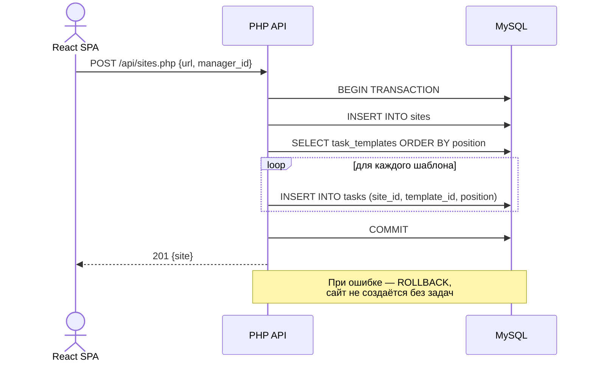
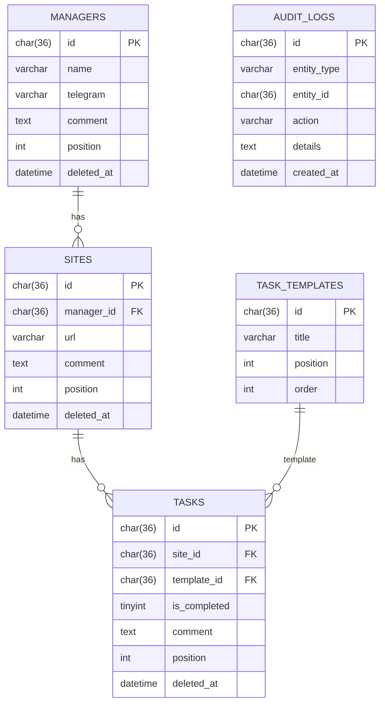

# SEO Workspace CRM

[](https://react.dev/)
[](https://www.typescriptlang.org/)
[](https://www.php.net/)
[](https://www.mysql.com/)

Коммерческая CRM-система для SEO-агентства. **В production с августа 2024.** Разработана под ключ: от сбора требований до деплоя на shared-хостинг.

Задача системы — управление портфелем клиентских сайтов: каждый менеджер ведёт список сайтов, по каждому сайту отслеживается прогресс задач из шаблона (Яндекс, Google, SEO, Метрика и др.).

---

## Интерфейс


*Канбан: менеджеры → сайты → задачи. Drag & Drop для перестановки и перемещения между менеджерами*


*Табличный вид с прогрессом каждого менеджера*

---

## Архитектурные решения

### Единый data-эндпоинт

Вместо N+1 запросов — один `GET /api/crm_data.php` собирает полное дерево `Managers → Sites → Tasks` тремя SELECT-запросами и формирует вложенную структуру на PHP. SPA получает всё за один HTTP-запрос и инициализируется без дозагрузок. На фронте данные кэшируются через `@tanstack/react-query` со `staleTime: 5min`.

### Транзакционное создание сайта

`POST /api/sites.php` выполняется в транзакции: INSERT сайта + цикл INSERT задач из `task_templates`. Если INSERT задач падает — полный откат через `rollBack()`. Порядок задач сохраняется через `position`.



### Soft Delete + Корзина

Сущности не удаляются физически: `DELETE` → `UPDATE deleted_at = NOW()`. Каскадная логика в запросах: `WHERE deleted_at IS NULL`. Отдельный эндпоинт `GET /api/trash.php` отдаёт все удалённые объекты по типам, `PUT /api/trash.php?type=site&id=X` восстанавливает через `deleted_at = NULL`.

### Undo-уведомление

Удаление не выполняется мгновенно — показывается toast с анимированным прогрессом и кнопкой «Отменить». Реальная операция происходит через 3 секунды через `setTimeout`. Если пользователь нажал «Отменить» — `isCancelled = true`, `clearTimeout`, операция не выполняется.

### Audit Log

Каждая мутирующая операция логируется в `audit_logs` с UUID v4 после успешного API-вызова: `entity_type`, `entity_id`, `action`, `details`. История доступна в модальном окне с фильтрацией по вкладкам.

---

## Схема базы данных



Индексы на все FK-поля и `deleted_at` для быстрой фильтрации soft-deleted записей.

---

## API

Все эндпоинты возвращают JSON. Prepared Statements через PDO — защита от SQL-инъекций.

| Метод | Эндпоинт | Описание |
|-------|----------|----------|
| `GET` | `/api/crm_data.php` | Полное дерево данных (единый запрос инициализации) |
| `GET/POST/PUT/DELETE` | `/api/managers.php` | CRUD менеджеров + soft delete |
| `GET/POST/PUT/DELETE` | `/api/sites.php` | CRUD сайтов, транзакционное создание с задачами |
| `GET/PUT/DELETE` | `/api/tasks.php` | Обновление статуса и комментариев задач |
| `GET/POST/PUT/DELETE` | `/api/templates.php` | Управление шаблонами задач |
| `GET/POST` | `/api/logs.php` | Audit Log |
| `GET/PUT` | `/api/trash.php` | Корзина и восстановление |

---

## Технологический стек

| Слой | Технологии |
|------|-----------|
| Frontend | React 18, TypeScript, Vite |
| UI | Ant Design 5, dnd-kit (Drag & Drop) |
| Состояние и кэш | @tanstack/react-query |
| Backend | PHP 8, PDO, Prepared Statements |
| База данных | MySQL 5.7+ / MariaDB 10.2+ |
| Хостинг | Shared-хостинг, Apache + mod_rewrite + `.htaccess` |

---

## Запуск

**Требования:** PHP 8.0+, MySQL 5.7+, Node.js 18+

```bash
git clone https://github.com/dizro/seo-workspace-crm.git
cd seo-workspace-crm

# БД: создать базу и импортировать схему + seed данные
mysql -u root -p your_db < mysql_setup.sql

# Backend: настроить подключение
cp api/config.example.php api/config.php
# Указать DB_HOST, DB_NAME, DB_USER, DB_PASS, APP_PASSWORD

# Frontend
npm install
npm run dev       # разработка → http://localhost:5173
npm run build     # production сборка → dist/
```

**Production:** содержимое `dist/` и папку `api/` → в `public_html/`. `.htaccess` настроен для SPA-роутинга.
